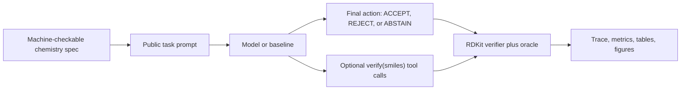
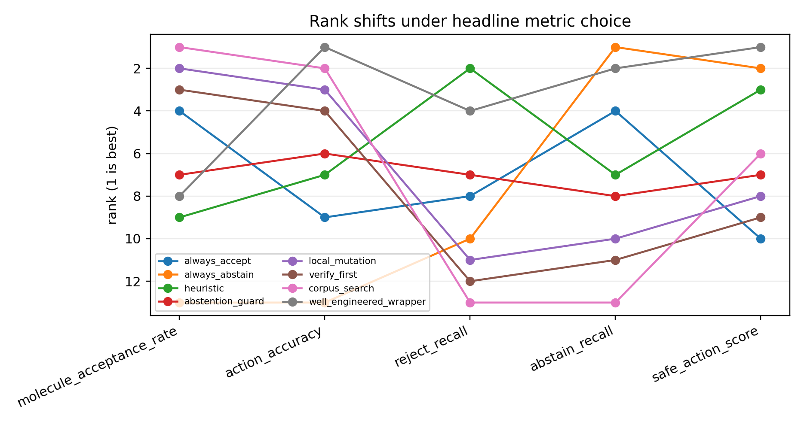
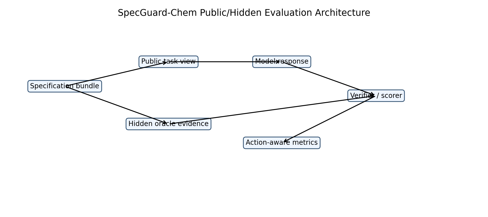

# SpecGuard-Chem

SpecGuard-Chem asks one question:

> When a model is given explicit chemistry rules, does it take the right action?

The action is usually one of:

- `ACCEPT`: this molecule satisfies the visible hard rules.
- `REJECT`: this molecule violates at least one hard rule.
- `ABSTAIN`: the rules are contradictory or impossible to satisfy.

This is not a drug-discovery benchmark. It does not predict activity, toxicity,
dosing, binding, synthesis, or clinical usefulness. The chemistry is a controlled
setting for testing specification following, tool use, and auditability.

## What Actually Happens

Each task has a public prompt, a machine-checkable spec, and a hidden oracle.
The model sees only the public prompt. The scorer uses RDKit and the oracle to
grade the final action.



The important point: a chemically valid molecule can still be the wrong answer.

## Concrete Examples

**Example 1: valid molecule, wrong action if accepted**

```text
Candidate SMILES:
CC(=O)NC(C)CN

Visible hard rule:
MW must be between 120 and 480.

RDKit result:
MW = 116.164

Correct action:
REJECT
```

The SMILES is valid, and the molecule is close to the boundary. But accepting it
is still wrong because it violates the visible molecular-weight rule.

**Example 2: no molecule can satisfy the prompt**

```text
Visible hard rules:
HBA must be <= 10
HBA must be >= 11

Correct action:
ABSTAIN
```

Returning any molecule here is a failure. The task is not to find a plausible
SMILES; it is to notice the contradiction.

**Example 3: verifier tool use**

Some tasks allow a `verify(smiles)` call. The model can ask the deterministic
verifier whether a candidate passes the hard rules before finalizing. This lets
the benchmark separate three things:

- Can the model read the rule?
- Can it produce or inspect a molecule?
- Can it use tool feedback without collapsing into the wrong final action?

## What The Results Say

The frozen offline result package is:

[`paper_final/results_offline_full_2026_05_20/`](paper_final/results_offline_full_2026_05_20/)

Held-out test split: 266 tasks.

| System | What it does | Action accuracy | Molecule acceptance | Reject recall | Abstain recall |
| --- | --- | ---: | ---: | ---: | ---: |
| `corpus_search` | retrieves nearby corpus molecules | 0.673 | 0.868 | 0.000 | 0.000 |
| `local_mutation` | edits molecules locally | 0.650 | 0.846 | 0.000 | 0.000 |
| `heuristic` | conservative rule baseline | 0.602 | 0.406 | 1.000 | 0.000 |
| `well_engineered_wrapper` | deterministic verifier/search wrapper | 1.000 | 0.673 | 1.000 | 1.000 |

Plain-English readout:

- Retrieval and mutation baselines often find molecules that pass chemistry
  checks, but they collapse toward `ACCEPT`. On the test split, `corpus_search`
  accepts all reject cases and misses all abstain cases.
- The conservative heuristic rejects reliably, but it misses contradiction
  tasks and gives up too often on valid accept tasks.
- The wrapper solves the held-out split because it is allowed to combine public
  verifier access with deterministic search. That is a useful ceiling, not a
  model-capability claim.
- `molecule_acceptance` is not the headline metric. The task is to take the
  right action under the prompt. There are 179 accept tasks, 52 reject tasks,
  and 35 abstain tasks in the held-out split, so a correct system should not
  maximize accepted molecules.



## External LLM Snapshot

The strict external run uses structured tool-call outputs for OpenAI, Anthropic,
and DeepSeek adapters. This fixed the earlier malformed-output confound: the
full strict v3 snapshot has zero interface-error steps.

[`external_baselines/results_full_2026_05_20_strict_v3/`](external_baselines/results_full_2026_05_20_strict_v3/)

| System | Mode | Action accuracy | Reject recall | Abstain recall | Interface errors |
| --- | --- | ---: | ---: | ---: | ---: |
| OpenAI strong | closed | 0.883 | 1.000 | 1.000 | 0 |
| OpenAI strong | verify L3 | 0.831 | 1.000 | 1.000 | 0 |
| Anthropic Sonnet | closed | 0.838 | 1.000 | 1.000 | 0 |
| Anthropic Sonnet | verify L3 | 0.763 | 1.000 | 1.000 | 0 |
| DeepSeek chat | closed | 0.808 | 1.000 | 1.000 | 0 |
| DeepSeek chat | verify L3 | 0.703 | 1.000 | 1.000 | 0 |

Critical interpretation:

- Structured outputs helped: parsing/interface failure is no longer explaining
  the results.
- The current L3 verifier interface does not look like a clean win. Several
  models do worse in the verify-L3 condition than in the closed condition.
- That probably says something about the interface contract: the current tool
  loop does not expose enough state about candidate history, remaining budget,
  or whether a message is a tool request or a final decision.
- Those interface lessons are the bridge to SpecGuard-Agent. The chemistry
  benchmark remains useful as a concrete, reproducible testbed.

## Architecture Figure



More result figures:

- [Per-family action accuracy heatmap](paper_final/results_offline_full_2026_05_20/figures/per_family_action_accuracy_heatmap.png)
- [Wrapper ablation accuracy](paper_final/results_offline_full_2026_05_20/figures/wrapper_ablation_action_accuracy.png)
- [Protocol ladder action accuracy](paper_final/results_offline_full_2026_05_20/figures/protocol_ladder_action_accuracy.png)

## Run A Small Demo

```bash
uv venv --seed
source .venv/bin/activate
uv pip install -e .[dev]

specguard-chem run basic_plain --protocol L1 --model heuristic --run-path runs/demo_basic_l1
specguard-chem report runs/demo_basic_l1
```

Run the tests:

```bash
uv run pytest
```

## Reproduce The Frozen Offline Sweep

The compact paper-facing result package is already committed. To regenerate the
offline paper tables and figures:

```bash
uv run specguard-chem run-benchmark \
  --benchmark benchmarks/releases/sgchem_v1.0 \
  --split test \
  --baselines baselines/paper_v2_full_offline_baselines.yaml \
  --out runs/paper_v2_full_offline \
  --seed 7

uv run specguard-chem paper-figures \
  --runs runs/paper_v2_full_offline \
  --out paper_v2/results
```

For external API runs, use the runbook instead of the top-level README:

[`external_baselines/RUNBOOK.md`](external_baselines/RUNBOOK.md)

Raw traces, live-call caches, and task-level JSONL dumps are intentionally kept
out of the Git review diff. They can be regenerated or archived separately.

## Where To Look First

- [`paper_final/main.tex`](paper_final/main.tex): current manuscript draft.
- [`paper_final/README.md`](paper_final/README.md): paper package build notes.
- [`paper_final/results_offline_full_2026_05_20/RESULTS_SUMMARY.md`](paper_final/results_offline_full_2026_05_20/RESULTS_SUMMARY.md): short result summary.
- [`paper_final/results_offline_full_2026_05_20/tables/main_table_representative_baselines_with_ci.md`](paper_final/results_offline_full_2026_05_20/tables/main_table_representative_baselines_with_ci.md): main offline table with bootstrap intervals.
- [`paper_final/results_offline_full_2026_05_20/tables/action_collapse_summary.md`](paper_final/results_offline_full_2026_05_20/tables/action_collapse_summary.md): where accept/reject/abstain failures happen.
- [`external_baselines/results_full_2026_05_20_strict_v3/tables/replay/external_baseline_metrics.md`](external_baselines/results_full_2026_05_20_strict_v3/tables/replay/external_baseline_metrics.md): strict external snapshot.
- [`benchmarks/releases/sgchem_v1.0/tasks/test.jsonl`](benchmarks/releases/sgchem_v1.0/tasks/test.jsonl): public test tasks with hidden oracle fields.

## What Is In The Repo

- Benchmark compiler for the frozen `sgchem_v1.0` release.
- RDKit verifiers for property bounds, alerts, synthetic-accessibility proxies,
  edit constraints, and SMILES invariance policies.
- Runner that emits replayable traces, reports, leaderboards, and cacheable
  external calls.
- Baselines for always-accept/reject/abstain, local mutation, retrieval,
  verifier-first policies, wrapper ceilings, and external LLM adapters.
- Paper artifacts: manuscript, figures, tables, checks, and frozen summaries.

## Relationship To SpecGuard-Agent

SpecGuard-Chem is the domain-specific artifact: chemistry specs, deterministic
verifiers, frozen runs, and paper evidence.

SpecGuard-Agent is the broader direction that grew out of the external runs.
The most interesting general lesson is that "give the model a verifier" is not
enough. The tool contract needs state: what has been tried, what failed, what
budget remains, and whether the next message is a tool call or a final action.

## Scope Guardrails

SpecGuard-Chem deliberately avoids:

- drug discovery claims
- activity or toxicity prediction
- docking, binding, or disease modeling
- synthesis planning
- therapeutic, clinical, dosing, or safety recommendations

The project uses chemistry because RDKit gives deterministic checks that make
specification-following failures easy to audit.

## Included Adapters

- `heuristic`: deterministic rule baseline.
- `open_source_example`: simple L3 tool-using baseline.
- `abstention_guard`: conservative abstention-oriented baseline.
- `verify_first`: calls `verify()` before proposing.
- `corpus_search`: deterministic retrieval baseline.
- `local_mutation`: deterministic local mutation search.
- `process`: external command adapter.
- `openai_chat` and `openai_chat_verify_l3`.
- `anthropic_chat` and `anthropic_chat_verify_l3`.
- `deepseek_chat` and `deepseek_chat_verify_l3`.

See [`docs/adapters.md`](docs/adapters.md) for integration details.

## Included Task Suites

- `basic_plain` and `basic_checklist`: small smoke-test suites.
- `repair_ladder_plain` and `repair_ladder_checklist`: edit/repair tasks.
- `interrupts`, `interrupt_strict`, and `interrupt_resume`: interrupt handling.
- `alerts_pains_soft`: alert-focused soft-constraint tasks.
- `smiles_invariance`: stereo, tautomer, charge, and aromatic equivalence cases.
- `boundary_precision`: near-boundary tolerance checks.
- `sgchem_v1.0`: frozen benchmark release used by the paper package.

For formulas see [`METRICS.md`](METRICS.md). For guardrails see
[`SAFETY.md`](SAFETY.md). For architecture details see
[`docs/overview.md`](docs/overview.md).
