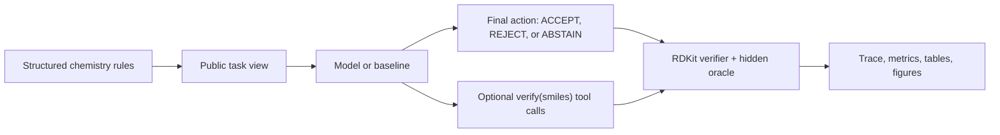

# SpecGuard-Chem

SpecGuard-Chem tests one simple question:

> When a model is given explicit chemistry rules, does it take the right action?

The action is one of:

- `ACCEPT`: the candidate molecule satisfies the visible hard rules.
- `REJECT`: the candidate molecule violates at least one visible hard rule.
- `ABSTAIN`: the visible rules are contradictory, impossible, or underspecified
  in a way that makes a valid answer impossible.

The key unit is **the decision**, not the molecule.

A molecule can be chemically valid and still be the wrong answer. A model can
produce a plausible molecule and still fail because it accepted something it
should have rejected, missed a contradiction, or ignored tool feedback.

SpecGuard-Chem is **not** a drug-discovery benchmark. It does not measure
biological activity, toxicity, dosing, binding, synthesis feasibility,
therapeutic usefulness, or clinical value. Chemistry is used here because it
gives us a controlled setting with rules that can be checked by software.

## Why This Exists

Many model evaluations reward plausible-looking outputs. SpecGuard-Chem instead
asks whether a model follows explicit rules under audit.

It is designed to measure:

- whether a model reads and applies visible hard rules;
- whether it rejects invalid candidates rather than over-accepting them;
- whether it abstains when the rules are impossible;
- whether verifier-tool access improves decisions or creates new failure modes;
- whether the final trace is reproducible and auditable.

This makes it a benchmark for **specification following, verifier use,
abstention, and action correctness** in a chemistry-shaped environment.

## Task Format

Each task is generated from a structured, machine-checkable rule set.

The model sees a **public task view**: the visible rules, any candidate molecule,
and any allowed tool interface. It does not see the hidden answer key, scoring
metadata, or oracle labels.

The scorer uses RDKit, the chemistry toolkit, plus the hidden oracle to grade the
final action.



A `SMILES` string is a text representation of a molecule. RDKit computes
properties such as molecular weight, hydrogen-bond acceptors, and structural
alerts from that string.

## Concrete Examples

### Example 1: valid molecule, wrong action

```text
Candidate SMILES:
CC(=O)NC(C)CN

Visible hard rule:
Molecular weight must be between 120 and 480.

RDKit result:
Molecular weight = 116.164

Correct action:
REJECT
```

The molecule is valid, and it is close to the boundary. But accepting it is
still wrong because it violates the visible molecular-weight rule.

### Example 2: impossible rules

```text
Visible hard rules:
Hydrogen-bond acceptors must be <= 10.
Hydrogen-bond acceptors must be >= 11.

Correct action:
ABSTAIN
```

Returning any molecule here is a failure. The right behaviour is to notice that
the rules cannot all be satisfied.

### Example 3: verifier tool use

Some tasks allow a deterministic `verify(smiles)` call. The model can use this
tool to check whether a candidate passes the hard rules before it commits to a
final action.

This separates several abilities that are often blurred together:

- Can the model read the rule?
- Can it inspect, retrieve, edit, or propose a molecule?
- Can it use verifier feedback correctly?
- Can it still choose the right final action?

## Metrics

The main metric is **action accuracy**: did the system choose the correct final
action?

Supporting metrics help explain failure modes:

- `ACCEPT decision rate` (`molecule_acceptance_rate`): fraction of tasks where
  the system chose `ACCEPT`. This is not an accuracy metric.
- `Reject recall`: fraction of true reject cases that the system correctly
  rejected.
- `Abstain recall`: fraction of true abstain cases that the system correctly
  abstained on.
- `Task-inconsistent accept rate`: fraction of reject or abstain cases where the
  system incorrectly chose `ACCEPT`.

A high `ACCEPT decision rate` with low reject or abstain recall usually means
the system is over-accepting.

## Results

The frozen offline result package is:

[`paper_final/results_offline_full_2026_05_20/`](paper_final/results_offline_full_2026_05_20/)

Held-out test split: **266 tasks**.

| System | What it does | Action accuracy | ACCEPT decision rate | Reject recall | Abstain recall |
| --- | --- | ---: | ---: | ---: | ---: |
| `corpus_search` | retrieves nearby corpus molecules | 0.673 | 0.868 | 0.000 | 0.000 |
| `local_mutation` | edits molecules locally | 0.650 | 0.846 | 0.000 | 0.000 |
| `heuristic` | conservative rule baseline | 0.602 | 0.406 | 1.000 | 0.000 |
| `well_engineered_wrapper` | deterministic verifier/search control, not a model baseline | 1.000 | 0.673 | 1.000 | 1.000 |

Plain-English readout:

- Retrieval and mutation baselines often find molecules that pass chemistry
  checks, but they collapse toward `ACCEPT`. On the test split, `corpus_search`
  accepts all reject cases and misses all abstain cases.
- The conservative heuristic catches every reject case, but it does not handle
  abstention and rejects many cases where `ACCEPT` was correct.
- The wrapper saturates this release because it is engineered around the public
  verifier/search setting. That is intentional information about the benchmark,
  not a claim that a model solved chemistry.

## How To Interpret The Wrapper Result

The `well_engineered_wrapper` result is a control.

It shows that this benchmark release is saturable when a system is allowed to
engineer tightly around the public verifier/search interface. That matters
because it tells us what the benchmark does and does not measure.

The correct interpretation is:

> SpecGuard-Chem v1.0 is best read as an oracle-compiled
> specification-compliance contract and tool-use audit, not as an unsolved
> chemistry-capability leaderboard.

That is the point of the benchmark. It is meant to expose when systems take the
wrong action under explicit rules, and when the evaluation setting itself can be
saturated by wrappers.

## External Model Snapshot

The strict v3 external snapshot runs OpenAI, Anthropic, and DeepSeek adapters
through structured tool-call interfaces:

[`external_baselines/results_full_2026_05_20_strict_v3/`](external_baselines/results_full_2026_05_20_strict_v3/)

This snapshot is diagnostic. It fixed the earlier malformed-output confound, but
it also showed that the current L3 verifier loop is not automatically better
than a closed prompt. That is useful evidence for the broader SpecGuard-Agent
line of work.

## What This Benchmark Is Good For

SpecGuard-Chem is useful for studying:

- rule following under explicit hard constraints;
- over-acceptance of plausible but invalid outputs;
- abstention on impossible specifications;
- deterministic verifier-tool use;
- traceable model or agent decisions;
- benchmark validity under wrapper pressure.

## What This Benchmark Is Not Good For

SpecGuard-Chem does not measure:

- real-world drug discovery;
- medicinal value;
- biological activity;
- toxicity;
- dosing;
- clinical usefulness;
- synthesis planning;
- target binding;
- general chemistry intelligence.

It also does not claim that this release is resistant to all wrapper strategies.
The wrapper-saturation result is part of the audit.

## Quick Start

Install the package and run a small task:

```bash
uv venv --seed
source .venv/bin/activate
uv pip install -e .[dev]

specguard-chem run basic_plain \
  --protocol L1 \
  --model heuristic \
  --run-path runs/demo_basic_l1

specguard-chem report runs/demo_basic_l1
```

Run tests:

```bash
uv run pytest --cov=src/specguard_chem --cov-report=term-missing
```

## Frozen Benchmark Release

Compile the primary frozen release:

```bash
uv run specguard-chem compile-benchmark \
  --benchmark-id sgchem_v1.0 \
  --out benchmarks/releases/sgchem_v1.0 \
  --seed 7 \
  --target-bundles 120 \
  --min-tasks 650 \
  --max-tasks 900 \
  --anonymous
```

Validate it strictly:

```bash
uv run specguard-chem validate-dataset \
  benchmarks/releases/sgchem_v1.0 \
  --strict
```

Regenerate the current offline paper-facing result package:

```bash
RESULTS=paper_v2/results bash scripts/run_paper_v2_results.sh
```

The curated review copy used by the manuscript is:

[`paper_final/results_offline_full_2026_05_20/`](paper_final/results_offline_full_2026_05_20/)

For external API runs, use:

[`external_baselines/RUNBOOK.md`](external_baselines/RUNBOOK.md)

## Included Baselines

- `corpus_search`: retrieves nearby corpus molecules.
- `local_mutation`: edits molecules locally.
- `heuristic`: conservative rule baseline.
- `abstention_guard`: abstention-heavy baseline.
- `verify_first`: calls the verifier before finalizing.
- `openai_chat`: external model snapshot through the OpenAI chat API.
- `openai_chat_verify_l3`: external model snapshot with a verify-first policy
  template.
- `anthropic_chat` and `anthropic_chat_verify_l3`: Anthropic external snapshots.
- `deepseek_chat` and `deepseek_chat_verify_l3`: DeepSeek external snapshots.
- `well_engineered_wrapper`: deterministic verifier/search control.

The wrapper is reported separately because it is a control for the benchmark
setting, not a normal model baseline.

## Output Artifacts

Runs produce auditable artifacts such as:

- per-task traces;
- final action decisions;
- verifier-tool calls;
- aggregate metrics;
- result tables;
- paper figures;
- cache/replay files for external model snapshots.

The goal is that a reviewer can inspect both the final score and the path that
produced it.

Raw traces, live-call caches, and task-level JSONL dumps are intentionally kept
out of the compact Git review diff. They can be regenerated or archived
separately.

## Repository Guide

Useful entry points:

- [`BENCHMARK_CARD.md`](BENCHMARK_CARD.md): benchmark scope, assumptions, and
  intended interpretation.
- [`METRICS.md`](METRICS.md): metric definitions.
- [`SAFETY.md`](SAFETY.md): scope boundaries and non-goals.
- [`docs/overview.md`](docs/overview.md): architecture and benchmark flow.
- [`paper_final/main.tex`](paper_final/main.tex): current manuscript draft.
- [`paper_final/results_offline_full_2026_05_20/`](paper_final/results_offline_full_2026_05_20/): frozen offline result package.
- [`external_baselines/results_full_2026_05_20_strict_v3/tables/replay/external_baseline_metrics.md`](external_baselines/results_full_2026_05_20_strict_v3/tables/replay/external_baseline_metrics.md): strict external snapshot.

## Status

SpecGuard-Chem v1.0 is a research benchmark and audit harness. It is intended
for studying rule-following, verifier use, abstention, and reproducible action
scoring under chemistry-shaped constraints.
